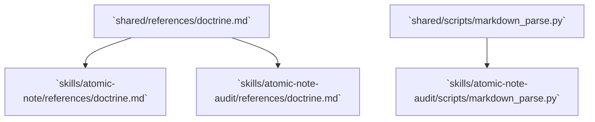
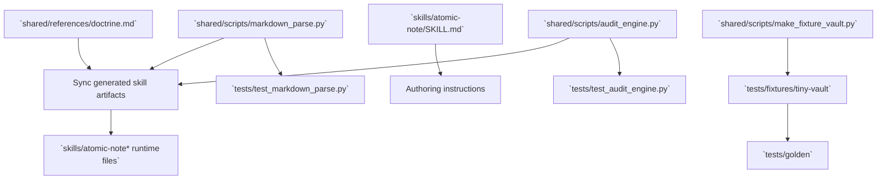

# Plain-Prose DAE for Non-Anki Atomic Notes - Plan

## Goal Capsule

- **Objective:** Align the atomic-note skills and deterministic audit with the plain-prose DAE shape for non-Anki notes.
- **Product authority:** GitHub issue #13, the confirmed Product Contract below, and the 2026-07-03 plan synthesis confirmation.
- **Execution profile:** Code, documentation, generated skill artifacts, synthetic fixtures, and deterministic golden outputs.
- **Stop conditions:** Stop if implementation discovers current repo fixtures or checked-in docs that still require heading-based non-Anki DAE to remain valid.
- **Tail ownership:** The implementer owns generated artifact sync, golden-output refresh, and the repo pre-commit check before handoff.

---

## Product Contract

### Summary

Non-Anki atomic notes will be authored and audited as headingless DAE prose: a Definition paragraph, an Analogy paragraph, and an Example paragraph beginning `For example,`.
Heading-based DAE will stop being a valid non-Anki shape, while Anki Basic and Cloze validation remain unchanged.

### Problem Frame

The skills repo is the last known artifact still mandating explicit DAE headings after the companion vault, vault template, and book material moved to plain prose.
The current doctrine requires headings because the deterministic audit keys off heading sections for non-Anki notes.
That leaves valid headingless prose notes at risk of false `invalid_dae` findings unless the doctrine and verifier change together.

### Key Decisions

- **Plain prose is canonical for non-Anki notes.** Supporting headings as an alternate valid non-Anki shape would preserve the old doctrine and hide drift.
- **Shared artifacts are the edit authority.** Generated skill-local references and scripts must be updated through `shared/` first, then synced to checked-in skill directories.
- **Fixture data must move with the detector.** The repo's synthetic notes and template still exercise heading-shaped DAE, so removing heading validation requires converting the fixtures that represent valid non-Anki notes.
- **No extra heading-style `Reference` clamp is required.** The companion vault was normalized to plain `Reference:` labels, so the existing trailing-label boundary is enough for current data.

### Requirements

**Doctrine and authoring**

- R1. Doctrine must define non-Anki DAE as plain prose with a Definition paragraph, an Analogy paragraph, and an Example paragraph beginning `For example,`.
- R2. Doctrine must keep the 10-50 rendered-word Definition rule and the `For example,` Example rule.
- R3. The atomic-note workflow must stop instructing agents to write `## Definition`, `## Analogy`, and `## Example` headings for non-Anki notes.
- R4. Any doctrine contract version metadata affected by this behavior change must be bumped only for the changed contract.

**Deterministic audit**

- R5. The audit must accept a headingless non-Anki note when body prose after the H1 contains a valid Definition paragraph followed by valid Analogy and Example paragraphs.
- R6. Plain-prose DAE detection must stop scanning before trailing `Reference:` or `Sources:` labels.
- R7. Heading-based DAE must be removed as a valid non-Anki detector shape after valid synthetic fixtures are converted.
- R8. Anki Basic and Cloze DAE detection must continue to validate the same shapes as before.

**Fixtures and documentation**

- R9. Synthetic fixture notes and the fixture generator must use plain-prose DAE for valid non-Anki atomic notes.
- R10. Parser tests must cover valid plain-prose DAE, missing Analogy, missing `For example,`, overlong Definition, unchanged Basic/Cloze behavior, and rejection of heading-only non-Anki DAE.
- R11. Audit-rubric text should stay unchanged unless implementation discovers a heading-specific rubric reference.
- R12. Generated skill-local artifacts must be synced from `shared/` before handoff.

### Acceptance Examples

- AE1. **Covers R1, R5.** Given a non-Anki note with an H1, a 10-50 word Definition paragraph, an Analogy paragraph using a clear "is like" style mapping, and an Example paragraph beginning `For example,`, when the audit analyzes DAE, then the note passes deterministic DAE validation.
- AE2. **Covers R5, R10.** Given a headingless non-Anki prose note without a valid Analogy paragraph, when the audit analyzes DAE, then the note fails DAE validation.
- AE3. **Covers R5, R10.** Given a headingless non-Anki prose note whose Example paragraph does not begin `For example,`, when the audit analyzes DAE, then the note fails DAE validation.
- AE4. **Covers R2, R10.** Given a headingless non-Anki prose note with a Definition longer than 50 rendered words, when the audit analyzes DAE, then it reports the overlong Definition condition rather than accepting the note.
- AE5. **Covers R7, R10.** Given a non-Anki note whose only DAE shape is `## Definition`, `## Analogy`, and `## Example` headings, when the audit analyzes DAE, then the headings alone do not make the note valid.
- AE6. **Covers R8.** Given existing valid Basic and Cloze Anki examples, when the audit analyzes DAE, then their pass/fail outcomes stay unchanged.
- AE7. **Covers R6.** Given a valid plain-prose note followed by `Reference:` or `Sources:` material, when the audit analyzes DAE, then trailing reference material is not treated as Analogy or Example prose.

### Success Criteria

- The skills no longer instruct agents to create non-Anki DAE headings.
- The deterministic audit no longer emits false `invalid_dae` for valid headingless non-Anki prose.
- Existing Basic and Cloze Anki test coverage remains green.
- Generated skill-local artifacts are in sync with `shared/`.
- The pre-commit check passes with deterministic golden outputs.

### Scope Boundaries

- Updating the private Obsidian vault template is outside this repo and already complete.
- Re-converting private vault notes is outside this repo and already complete.
- Updating the `networked-thinking-book` repo is outside this repo and already complete.
- Re-syncing installed copies under `~/.agents/skills` is outside this change.
- Supporting future `## Reference` or `## Sources` heading clamps is not included unless implementation finds a current synthetic or repo-local need.

### Dependencies / Assumptions

- The 34 private heading-format notes were converted to plain prose before this repo drops heading detection.
- Private vault `## Reference` headings were normalized to plain `Reference:` labels before this repo relies on the existing trailing-label clamp.
- Tests and examples must remain synthetic and reusable.
- The implementation must avoid mutating real vault material from this repo.

### Sources / Research

- GitHub issue #13: `https://github.com/jrgilbertson/networked-thinking-skills/issues/13`
- Repo instructions: `AGENTS.md`
- Current doctrine source: `shared/references/doctrine.md`
- Current parser source: `shared/scripts/markdown_parse.py`
- Atomic-note workflow gap: `skills/atomic-note/SKILL.md`
- Synthetic fixture source: `shared/scripts/make_fixture_vault.py`
- Parser tests: `tests/test_markdown_parse.py`
- Audit rubric check: `shared/references/audit-rubric.md`

---

## Planning Contract

### Product Contract Preservation

Product Contract unchanged.

### Key Technical Decisions

- **Plain-prose detection mirrors Basic-card parsing.** The detector should reuse the existing paragraph extraction, rendered-word count, analogy detection, and example-prefix helpers so non-Anki prose and Anki `Back:` prose share the same DAE semantics.
- **Heading-only DAE is removed from accepted candidates.** Heading extraction can remain for unrelated structure analysis, but `analyze_dae` and `has_dae_sections` should not treat `## Definition` / `## Analogy` / `## Example` as a valid non-Anki DAE shape.
- **Doctrine versioning becomes contract-specific.** The current audit engine uses one version constant for schema, doctrine, rubric, and prompt output, so this change should split version constants and bump only the doctrine contract.
- **Fixtures are migrated before goldens are regenerated.** Valid synthetic non-Anki notes should be converted to plain prose first; then audit JSONL, report, and Base goldens can be refreshed from deterministic fixture output.

### High-Level Technical Design

### Implementation Constraints

- Edit canonical files under `shared/` before generated skill-local copies.
- Keep fixture changes synthetic; do not import private vault notes or names.
- Preserve existing Anki Basic and Cloze behavior while changing non-Anki validation.
- Keep exact parser helper names and signatures flexible during implementation unless tests or downstream imports require preserving them.

### Deferred to Implementation

- Exact helper naming for the plain-prose body region can be chosen during implementation.
- Exact golden content hashes will be determined by the regenerated synthetic fixture files.

---

## Implementation Units

### U1. Update Doctrine and Authoring Instructions

- **Goal:** Make plain-prose DAE the documented non-Anki shape everywhere authors and agents read doctrine.
- **Requirements:** R1, R2, R3, R4.
- **Dependencies:** None.
- **Files:** `shared/references/doctrine.md`, `skills/atomic-note/SKILL.md`, `pyproject.toml`, `skills/atomic-note/references/doctrine.md`, `skills/atomic-note-audit/references/doctrine.md`.
- **Approach:** Update the canonical doctrine wording in `shared/references/doctrine.md`, update the non-generated atomic-note workflow step directly, and reserve skill-local doctrine edits for artifact sync. Bump the doctrine contract in `pyproject.toml` because heading-only non-Anki notes stop being valid.
- **Patterns to follow:** `AGENTS.md` source-of-truth rules and the existing doctrine wording for Basic/Cloze DAE prose.
- **Test scenarios:**
  - Verify the canonical doctrine says non-Anki notes use plain DAE prose without Anki metadata and no longer asks for DAE headings.
  - Verify the atomic-note workflow step no longer instructs agents to create explicit DAE headings.
  - Verify synced skill-local doctrine matches the canonical doctrine after U6.
- **Verification:** `shared` doctrine, skill workflow text, and generated doctrine copies all describe the same non-Anki shape.

### U2. Split Audit Contract Versions

- **Goal:** Let audit rows report the new doctrine version without falsely changing schema, rubric, or prompt versions.
- **Requirements:** R4.
- **Dependencies:** U1.
- **Files:** `shared/scripts/audit_engine.py`, `skills/atomic-note-audit/scripts/audit_engine.py`, `tests/test_audit_engine.py`, `tests/golden/fixture-audit.jsonl`, `tests/golden/fixture-manifest.json`.
- **Approach:** Replace the single audit version constant with separate schema, doctrine, rubric, and prompt constants. Keep schema, rubric, prompt, and manifest schema output at their current versions; report the bumped doctrine version only on audit rows.
- **Patterns to follow:** Existing audit row fields and schema validation tests that treat versions as separate contracts.
- **Test scenarios:**
  - Audit a synthetic note and assert `doctrine_version` uses the bumped doctrine version while `rubric_version` and `prompt_version` remain unchanged.
  - Audit a fixture run and assert the manifest schema version remains unchanged.
  - Validate the regenerated golden JSONL without schema changes.
- **Verification:** Audit metadata reflects the doctrine-only contract change and no schema/rubric/prompt version drift appears in tests or goldens.

### U3. Add Plain-Prose DAE Detection and Remove Heading DAE Validation

- **Goal:** Make deterministic DAE validation accept headingless non-Anki prose and reject heading-only non-Anki DAE.
- **Requirements:** R5, R6, R7, R8, R10.
- **Dependencies:** U1.
- **Files:** `shared/scripts/markdown_parse.py`, `skills/atomic-note-audit/scripts/markdown_parse.py`, `tests/test_markdown_parse.py`.
- **Approach:** Add a plain-prose DAE candidate that reads paragraphs after the note H1 and before trailing `Reference:` or `Sources:` labels, then delegates to the same DAE builder used by Basic cards. Remove heading-section DAE from the accepted candidate list and update `has_dae_sections` to reflect accepted DAE shapes rather than raw heading presence.
- **Patterns to follow:** `_analyze_basic_card_dae`, `_prose_paragraphs`, `_build_dae_analysis`, `TRAILING_LABEL_LINE_RE`, `_looks_like_analogy`, and `_starts_with_example`.
- **Test scenarios:**
  - Covers AE1. A headingless note with valid Definition, Analogy, and Example paragraphs returns `present=True` and a plain-prose shape.
  - Covers AE2. A headingless note without a valid analogy returns `present=False` with `has_analogy=False`.
  - Covers AE3. A headingless note whose example paragraph does not start with `For example,` returns `present=False` with `has_example=False`.
  - Covers AE4. A headingless note with an over-50-word Definition returns `present=False` with `definition_too_long=True`.
  - Covers AE5. A note whose only DAE shape is DAE headings returns `present=False`.
  - Covers AE6. Existing Basic and Cloze test cases keep their current shape and pass/fail outcomes.
  - Covers AE7. Trailing `Reference:` and `Sources:` sections are not used as analogy or example prose.
- **Verification:** Parser tests prove the new accepted shape, the removed heading shape, and unchanged Anki behavior.

### U4. Add Audit-Level Regression Coverage

- **Goal:** Prove the parser change produces the intended audit findings and priorities, not just isolated parser objects.
- **Requirements:** R5, R6, R7, R8, R10.
- **Dependencies:** U2, U3.
- **Files:** `tests/test_audit_engine.py`, `shared/scripts/audit_engine.py`.
- **Approach:** Add audit-level cases for a valid headingless non-Anki note, heading-only non-Anki DAE, overlong plain-prose Definition, and trailing Reference/Sources material. Avoid changing the weak-DAE heuristic unless a failing test shows it contradicts the Product Contract.
- **Patterns to follow:** Existing `audit_single_note` tests for Basic/Cloze DAE, overlong definitions, and reference/source handling.
- **Test scenarios:**
  - Covers AE1. A valid headingless non-Anki note has no `invalid_dae`.
  - Covers AE4. A plain-prose note with an overlong Definition emits `definition_too_long` rather than `invalid_dae`.
  - Covers AE5. A heading-only non-Anki note emits `invalid_dae` after heading validation is removed.
  - Covers AE7. Reference/Sources content after valid plain prose does not cause false pass or false failure.
- **Verification:** Audit tests demonstrate the user-facing finding behavior expected by issue #13.

### U5. Convert Synthetic Fixtures and Regenerate Goldens

- **Goal:** Keep repo fixtures aligned with the new non-Anki note shape and preserve deterministic golden outputs.
- **Requirements:** R9, R10.
- **Dependencies:** U3, U4.
- **Files:** `shared/scripts/make_fixture_vault.py`, `tests/fixtures/tiny-vault/Atomic Notes/*.md`, `tests/fixtures/tiny-vault/Templates/Atomic Note Template.md`, `tests/golden/fixture-audit.jsonl`, `tests/golden/fixture-report.md`, `tests/golden/fixture-audit.base`, `tests/golden/fixture-manifest.json`, `tests/test_fixture_vault.py`, `tests/test_report_generation.py`, `tests/test_base_generation.py`.
- **Approach:** Convert valid synthetic non-Anki fixture notes and the synthetic template to plain prose. Prefer `Reference:` labels over `## Links` in valid fixtures so the detector boundary matches doctrine. Regenerate deterministic audit, report, and Base goldens after fixture content and doctrine version output settle.
- **Patterns to follow:** `docs/audit-workflow.md` fixture regeneration flow and existing golden tests that compare report/Base output exactly.
- **Test scenarios:**
  - Fixture generation creates valid plain-prose non-Anki notes with no DAE headings in the valid examples.
  - Golden no-change rows remain no-change for the clean, optional Anki, and reference/source examples.
  - Golden report KPIs and bucket counts remain intentional after fixture content hashes and doctrine versions change.
  - Generated Base output still matches its golden file.
- **Verification:** Fixture, report, Base, and JSONL validation tests pass against the regenerated synthetic artifacts.

### U6. Sync Generated Skill Artifacts and Run Final Checks

- **Goal:** Propagate canonical shared changes into installable skill directories and prove the repo is ready for handoff.
- **Requirements:** R11, R12.
- **Dependencies:** U1, U2, U3, U5.
- **Files:** `skills/atomic-note/references/doctrine.md`, `skills/atomic-note-audit/references/doctrine.md`, `skills/atomic-note-audit/scripts/markdown_parse.py`, `skills/atomic-note-audit/scripts/audit_engine.py`, `shared/references/audit-rubric.md`, `tests/test_skill_artifact_sync.py`, `tests/test_skill_integrity.py`.
- **Approach:** Run artifact sync after all canonical shared edits are complete, verify the audit rubric has no heading-specific wording, and leave the rubric unchanged unless a direct heading reference is found.
- **Patterns to follow:** `shared/scripts/sync_skill_artifacts.py` artifact spec and the repo pre-commit hook.
- **Test scenarios:**
  - Artifact sync check reports no stale generated references or scripts.
  - Skill integrity tests confirm installed-skill references remain self-contained.
  - Audit rubric search finds no heading-specific DAE requirement.
  - Full pre-commit passes after all units land.
- **Verification:** Generated artifacts are in sync, no stale shared references remain, and the repo pre-commit check is green.

---

## Verification Contract

| Gate | Command | Proves |
|---|---|---|
| Parser and audit focus | `env PYTHONDONTWRITEBYTECODE=1 python3 -m unittest tests.test_markdown_parse tests.test_audit_engine` | Plain-prose DAE behavior, removed heading validation, and unchanged Basic/Cloze behavior. |
| Fixture/golden focus | `env PYTHONDONTWRITEBYTECODE=1 python3 -m unittest tests.test_fixture_vault tests.test_report_generation tests.test_base_generation` | Synthetic fixture conversion and regenerated deterministic outputs. |
| JSONL validation | `python3 -m shared.scripts.validate_jsonl tests/golden/fixture-audit.jsonl` | Regenerated audit rows still satisfy the schema. |
| Artifact sync | `python3 -m shared.scripts.sync_skill_artifacts --check` | Skill-local generated artifacts match canonical shared files. |
| Full repo gate | `lefthook run pre-commit --force --no-auto-install` | The same checks required by project instructions pass before handoff. |

---

## Definition of Done

- U1 is done when doctrine and workflow text consistently describe plain-prose non-Anki DAE and the doctrine contract version is bumped without unrelated contract bumps.
- U2 is done when audit output can report separate schema, doctrine, rubric, and prompt versions and the doctrine-only bump is reflected in regenerated rows.
- U3 is done when parser tests show valid plain prose passes, missing components fail, overlong definitions remain specific, heading-only DAE fails, and Basic/Cloze behavior is unchanged.
- U4 is done when audit-level tests prove the expected `invalid_dae` and `definition_too_long` outcomes for plain-prose and heading-only notes.
- U5 is done when synthetic fixtures and goldens are regenerated, deterministic, and still use only synthetic material.
- U6 is done when generated skill artifacts are synced, rubric scope is confirmed, and `lefthook run pre-commit --force --no-auto-install` passes.
- The final diff contains no abandoned exploratory code, no private vault material, and no unsynced generated artifacts.
