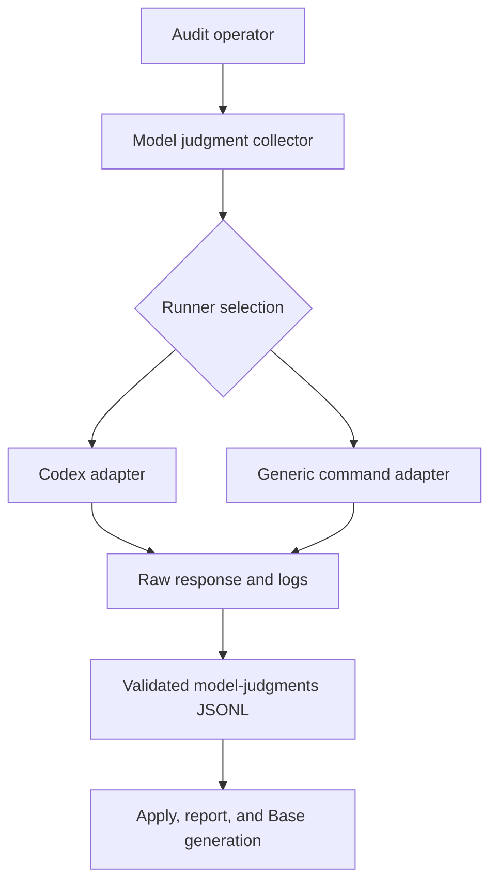
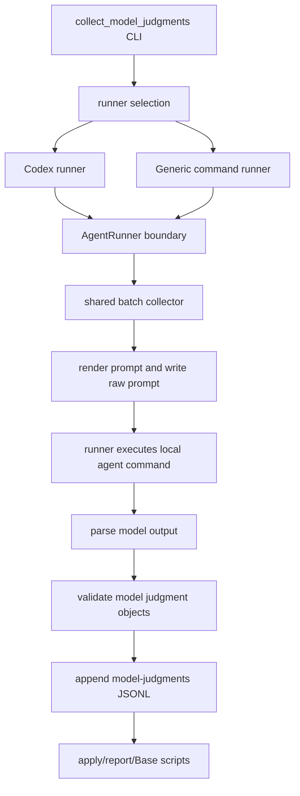

# Runner Adapters for Model Judgment Collection - Plan

## Goal Capsule

- **Objective:** Make model judgment collection runner-first so local agent CLIs can be swapped without changing the audit JSONL pipeline.
- **Product authority:** GitHub issue #1, the confirmed Product Contract below, and the 2026-07-06 plan synthesis confirmation that omitted-runner behavior is compatibility-only.
- **Execution profile:** Python CLI script, unit tests, documentation, generated skill artifacts, and repo validation.
- **Stop conditions:** Stop if implementation discovers that preserving old no-runner commands requires presenting Codex as the conceptual default rather than a compatibility path.
- **Tail ownership:** The implementer owns generated artifact sync, docs/help alignment, and the repo pre-commit check before handoff.

---

## Product Contract

### Summary

Model judgment collection will expose runner selection as the user-facing abstraction.
Codex remains supported as one adapter, while a generic command runner lets other local agent CLIs execute the same prompt and return the same validated JSONL judgment objects.

### Problem Frame

The atomic-note audit workflow is already contract-shaped around JSONL handoffs: deterministic audit rows feed model judgment collection, model judgments are validated, and downstream apply/report/Base steps consume the same structured outputs.
The model-judgment collection entry point is the exception because its CLI and documentation currently present the collection path in Codex-specific terms.

This matters for an open-source skill package because users may run Claude Code, Codex CLI, Hermes, OpenCode-style tools, or another local agent.
They should not need a different audit pipeline when only the local agent invocation changes.

### Key Decisions

- **Runner-first interface.** The chosen runner is the primary user-facing choice for model judgment collection, and shared collection behavior remains outside individual adapters.
- **Codex is supported but not privileged.** Existing Codex behavior should be preserved through a Codex adapter, not by treating Codex as the collector's conceptual default.
- **A generic command runner proves the abstraction.** The first non-Codex path should support local command templates that can receive prompts and return final responses without requiring stable first-class contracts for every agent.
- **JSONL contracts stay stable.** Runner selection changes how a prompt is executed, not the model judgment schema or downstream audit/apply/report/Base contracts.

### Actors

- A1. **Audit operator:** Runs model judgment collection against an Obsidian vault and chooses the local agent runner.
- A2. **Runner adapter:** Invokes one local agent command, passes the prompt, captures the final response, and records raw logs.
- A3. **Shared collector:** Owns batching, resumability, parsing, validation, retry behavior, and append-only model judgment output.
- A4. **Downstream audit tools:** Consume model judgment JSONL without caring which runner produced it.

### Key Flows

- F1. **Runner-selected collection**
  - **Trigger:** A1 starts model judgment collection.
  - **Actors:** A1, A2, A3.
  - **Steps:** A1 selects a runner; A3 builds each batch prompt; A2 executes the prompt through its local agent command; A3 parses and validates the returned judgments.
  - **Outcome:** Valid judgments are appended to the model judgment JSONL output.
  - **Covered by:** R1, R2, R3, R4.
- F2. **Model drift recovery**
  - **Trigger:** A2 returns malformed output, incomplete judgments, or invalid judgment objects.
  - **Actors:** A2, A3.
  - **Steps:** A3 applies the same validation and split-and-retry behavior regardless of runner.
  - **Outcome:** Retryable batch failures are narrowed, while non-retryable runner or environment failures surface clearly.
  - **Covered by:** R3, R8, R9.
- F3. **Downstream handoff**
  - **Trigger:** Collection finishes with validated model judgments.
  - **Actors:** A3, A4.
  - **Steps:** A4 reads the same model judgment JSONL contract used before runner selection existed.
  - **Outcome:** Apply, report, and Base generation require no runner-specific changes.
  - **Covered by:** R7.

### Requirements

**Runner selection and adapter ownership**

- R1. The collector must make the chosen runner explicit in normal usage, with Codex presented as one supported runner rather than the implicit default.
- R2. The Codex runner must preserve the current Codex collection behavior through adapter-specific configuration.
- R3. The shared collector must continue to own batching, resumability, raw prompt/log paths, model output parsing, validation, split-and-retry behavior, and append-only `model-judgments.jsonl`.
- R4. Runner adapters must own only local agent invocation mechanics: prompt handoff, final response capture, raw stdout/stderr capture, and adapter-specific safety or isolation flags.

**Generic command runner**

- R5. A generic command runner must provide a documented non-Codex path for local agent CLIs that can receive prompts and return final responses through stdout or a file.
- R6. Unit tests for the generic command path must use deterministic fake commands or helpers, not real external agent CLIs.

**Contracts, privacy, and failure behavior**

- R7. Deterministic audit, apply, report, and Base generation must continue to consume the same JSONL contracts without runner-specific changes.
- R8. Raw prompts and logs must remain outside the vault by default because they can contain private note content.
- R9. Validation failures, model drift, and split-and-retry behavior must remain runner-independent.
- R10. Backward compatibility for old Codex-oriented invocations may exist, but it must route through the runner abstraction and be documented as compatibility rather than a default abstraction.

### Acceptance Examples

- AE1. **Covers R1, R2, R10.** Given an operator uses the Codex runner, when collection runs, then the prompt handoff, raw logs, timeout behavior, and validated JSONL output match today's Codex-backed collection behavior.
- AE2. **Covers R1, R5, R6.** Given an operator configures the generic command runner with a deterministic fake command in tests, when collection runs, then the fake command receives the prompt and the collector appends valid model judgment JSONL.
- AE3. **Covers R3, R8, R9.** Given any runner returns malformed or incomplete judgment output for a multi-note batch, when validation fails in a retryable way, then the collector uses the same split-and-retry behavior it uses today.
- AE4. **Covers R4, R7.** Given collection finishes through either Codex or the generic command runner, when downstream apply/report/Base scripts run, then they consume the same model judgment JSONL without knowing the runner.
- AE5. **Covers R8.** Given raw prompts and logs are written during collection, when the operator uses the documented defaults, then those files are written outside the vault unless the operator explicitly chooses otherwise.

### Success Criteria

- Runner selection is visible in the collector CLI and docs as the normal abstraction.
- Codex and generic command runners are both documented and covered by unit tests.
- Tests cover runner dispatch, prompt handoff, output parsing, validation failure, and split-and-retry behavior.
- Audit/apply/report/Base workflows remain unchanged at the JSONL contract boundary.
- The repo pre-commit check passes after generated skill artifacts are synced if shared collector files change.

### Scope Boundaries

- First-class adapters for Claude Code, Hermes, OpenCode-style tools, or other agents are deferred until their CLI contracts are stable enough.
- Model judgment schema, model judgment prompt semantics, deterministic audit behavior, apply behavior, report generation, and Base generation are not in scope.
- Unit tests must not require installed external agent CLIs.
- Raw prompt and log storage inside a user's vault is not the default path.
- Choosing or recommending a user's preferred local agent is outside this change.

### Dependencies / Assumptions

- At least one useful class of local agent CLIs can be represented by a command-template runner that accepts prompt input and exposes a final response through stdout or a file.
- Existing Codex-oriented usage can be preserved without making Codex the default abstraction.
- Synthetic fixtures and fake commands are sufficient to test runner dispatch and failure behavior without private vault material.

### Sources / Research

- GitHub issue #1: `https://github.com/jrgilbertson/networked-thinking-skills/issues/1`
- Current collector source: `shared/scripts/collect_model_judgments.py`
- Current collector tests: `tests/test_collect_model_judgments.py`
- Current workflow docs: `docs/audit-workflow.md`
- Repo instructions: `AGENTS.md`

---

## Planning Contract

### Product Contract Preservation

Product Contract unchanged.

### Key Technical Decisions

- **KTD1. Select runners at the CLI boundary.** The collection function already accepts an `AgentRunner`, so implementation should build the selected adapter before entering shared collection rather than branching inside batching, parsing, validation, or append logic.
- **KTD2. Keep runner-specific options local to their adapter.** Codex-specific flags stay attached to the Codex adapter, while command-runner options describe generic command execution and response capture.
- **KTD3. Treat no-runner invocation as compatibility, not product shape.** If old commands remain accepted, the help text and docs should still teach runner-first usage and describe the no-runner path as legacy compatibility.
- **KTD4. Separate invocation failures from model-output drift.** Malformed model output should keep the existing validation and split-and-retry behavior, while local command launch failures should surface without pointless batch splitting.
- **KTD5. Sync the installed audit skill from shared sources.** `shared/scripts/collect_model_judgments.py` is canonical, and the checked-in `skills/atomic-note-audit/scripts/collect_model_judgments.py` copy must be generated through artifact sync.

### High-Level Technical Design

The collector should keep one shared path after a runner is selected.
Adapters differ only in how they execute a prompt and where they place raw output.

### Implementation Constraints

- Edit the canonical shared collector before syncing the installable audit skill copy.
- Keep raw prompt and log defaults outside the vault in docs and examples.
- Use deterministic fake commands or fake runners in tests; do not require Codex, Claude, Hermes, or any other real local agent CLI.
- Preserve existing public JSONL contracts and existing downstream script behavior.
- Keep command-runner syntax narrow enough to prove the adapter abstraction without overfitting to one external CLI.

### System-Wide Impact

- **CLI contract:** The user-facing collector changes from Codex-first wording to runner-first usage, with compatibility handled carefully.
- **Installed skills:** The runtime copy under `skills/atomic-note-audit/scripts/` must stay self-contained after artifact sync and must not import `shared`.
- **Privacy posture:** More runner options increase the chance users store raw prompt logs incorrectly, so docs and help text need runner-neutral raw-dir warnings.
- **Agent parity:** The work improves parity across local agent setups without introducing a repo-owned inference service or provider-auth layer.

### Risks & Dependencies

- **Generic command ambiguity:** Local agent CLIs vary in how they accept prompts and expose final responses, so the generic runner should start with a small documented contract rather than trying to model every CLI.
- **Compatibility confusion:** Supporting old no-runner commands can undercut the abstraction if help text presents Codex as the ordinary path.
- **Retry semantics:** Treating command launch failures as retryable model drift would waste time and hide environment problems.
- **Artifact drift:** Direct edits to the skill-local collector copy would be overwritten or fail sync checks.

### Sources / Research

- `shared/scripts/collect_model_judgments.py` already defines `AgentRunner`, `CodexRunner`, shared batching, model output parsing, validation, split-and-retry, and append-only JSONL output.
- `tests/test_collect_model_judgments.py` already uses fake runners for prompt handoff, resumability, parsing, validation failure, and split behavior.
- `shared/scripts/sync_skill_artifacts.py` declares `collect_model_judgments.py` as a generated `atomic-note-audit` runtime script.
- `docs/audit-workflow.md` and `skills/atomic-note-audit/SKILL.md` currently teach Codex-specific collector usage.
- `docs/solutions/conventions/plain-prose-dae-contract-migration.md` reinforces the repo convention: update canonical shared artifacts first, then sync generated skill-local copies.

---

## Implementation Units

### U1. Runner-First CLI and Adapter Factory

- **Goal:** Make runner selection the collection entry point while preserving Codex behavior through the Codex adapter.
- **Requirements:** R1, R2, R3, R4, R10, F1, AE1.
- **Dependencies:** None.
- **Files:** `shared/scripts/collect_model_judgments.py`, `tests/test_collect_model_judgments.py`.
- **Approach:** Add a runner-selection layer that constructs an `AgentRunner` before calling shared collection.
  Keep collection internals runner-agnostic and isolate Codex-specific settings in the Codex adapter path.
  Treat omitted-runner support, if retained, as compatibility in parser/help behavior rather than as the preferred contract.
- **Execution note:** Start with CLI/factory tests before changing the collector entry point so compatibility and runner-first behavior are pinned.
- **Patterns to follow:** Existing `AgentRunner` protocol, `CodexRunner`, `FakeRunner`, and `collect_model_judgments()` injection tests.
- **Test scenarios:**
  - Selecting the Codex runner constructs a Codex-backed runner and preserves current prompt handoff, raw logs, timeout, model, sandbox, and user-config behavior.
  - Omitting the runner either fails with a clear runner-selection error or routes through an explicitly tested compatibility path, matching the implementation decision.
  - Codex-specific options are accepted only for the Codex adapter path.
  - Shared collection tests still pass when the runner is injected directly.
- **Verification:** Collector CLI selection is runner-first, and Codex behavior remains available without branching inside shared batching or validation logic.

### U2. Generic Command Runner

- **Goal:** Add a deterministic non-Codex adapter path for local agent CLIs that can receive a prompt and return a final response.
- **Requirements:** R3, R4, R5, R6, R8, R9, F1, F2, AE2, AE3.
- **Dependencies:** U1.
- **Files:** `shared/scripts/collect_model_judgments.py`, `tests/test_collect_model_judgments.py`.
- **Approach:** Implement a generic command runner that accepts the rendered prompt through a documented command contract and writes the final response to the same output path consumed by `parse_model_output()`.
  Capture raw stdout and stderr to the same per-batch log paths used by the Codex adapter.
  Keep command-runner configuration generic: prompt input, final-response capture, working directory, timeout, and raw log capture.
- **Execution note:** Use deterministic helper commands in tests instead of invoking any real local agent CLI.
- **Patterns to follow:** Current `CodexRunner.run()` raw output handling and existing fake-runner test style.
- **Test scenarios:**
  - A fake command receives the prompt and returns valid JSONL through stdout; the collector appends validated judgments.
  - A fake command writes the final response to the configured response file; stdout and stderr are still captured as raw logs.
  - A fake command returns malformed JSONL; validation fails and split-and-retry behavior remains collector-owned.
  - A fake command fails to launch or exits unsuccessfully; the collector surfaces an invocation failure without treating it as model-output drift.
  - Command-runner raw prompt, stdout, stderr, and final-response files stay under `--raw-dir`.
- **Verification:** The generic command runner proves a non-Codex path without external agent dependencies in tests.

### U3. Runner-Independent Failure Semantics

- **Goal:** Keep retry behavior tied to model-output validity rather than to the runner implementation.
- **Requirements:** R3, R7, R9, F2, F3, AE3, AE4.
- **Dependencies:** U1, U2.
- **Files:** `shared/scripts/collect_model_judgments.py`, `tests/test_collect_model_judgments.py`.
- **Approach:** Review the current retryable error boundary and separate model-response problems from local invocation or environment problems.
  Preserve split-and-retry for malformed output, mismatched note paths, missing judgments, and schema validation failures.
  Ensure non-model runner failures surface clearly enough for users to fix their local command configuration.
- **Patterns to follow:** Existing tests for validation-driven split behavior, programmer errors, and OS errors.
- **Test scenarios:**
  - A multi-note batch with a note-path mismatch splits and retries with smaller batches.
  - A single-note validation failure surfaces after retry narrowing.
  - Runner invocation failure does not recurse through split-and-retry.
  - Downstream JSONL output remains unchanged when valid judgments are produced by either runner.
- **Verification:** Failure tests distinguish model drift from runner/environment failures, and downstream JSONL contracts remain stable.

### U4. Runner-Aware Docs and Skill Guidance

- **Goal:** Teach runner-first usage in both repo docs and the installable audit skill workflow.
- **Requirements:** R1, R5, R7, R8, R10, AE4, AE5.
- **Dependencies:** U1, U2.
- **Files:** `docs/audit-workflow.md`, `skills/atomic-note-audit/SKILL.md`, `tests/test_repo_smoke.py`.
- **Approach:** Update model-judgment workflow prose and examples so runner selection is the ordinary path.
  Show Codex as a supported runner example and include one generic command-runner example.
  Keep the raw-dir privacy warning runner-neutral and make clear that downstream apply/report/Base commands do not change.
- **Patterns to follow:** Existing audit workflow command blocks and the skill's "active desktop or terminal agent" trust-boundary wording.
- **Test scenarios:**
  - Documentation examples include runner selection for Codex and generic command usage.
  - Privacy guidance still tells users to keep raw prompts and logs outside the vault by default.
  - Downstream apply/report/Base examples remain unchanged.
- **Verification:** A reader can find both Codex and generic command-runner paths without concluding Codex is the conceptual default.

### U5. Generated Artifact Sync and Installed-Skill Smoke Coverage

- **Goal:** Propagate shared collector changes into the checked-in installable audit skill and verify the copy stays self-contained.
- **Requirements:** R2, R5, R6, R8, R10, AE1, AE2, AE5.
- **Dependencies:** U1, U2, U3, U4.
- **Files:** `skills/atomic-note-audit/scripts/collect_model_judgments.py`, `tests/test_skill_artifact_sync.py`, `tests/test_skill_integrity.py`.
- **Approach:** Run artifact sync after shared collector edits and review the generated script copy.
  Add or adjust smoke expectations only if the new CLI help or generated artifact shape needs coverage beyond the existing sync and integrity tests.
- **Patterns to follow:** `shared/scripts/sync_skill_artifacts.py` artifact spec and existing no-stale-shared-reference tests.
- **Test scenarios:**
  - `sync_skill_artifacts --check` reports no drift after syncing.
  - Skill-local runtime scripts do not contain stale `shared` imports or paths.
  - The installed-skill collector help exposes runner-first usage from the self-contained script copy.
- **Verification:** Shared and skill-local collector behavior stay aligned, and the installable skill remains self-contained.

---

## Verification Contract

| Gate | Command | Success Signal |
|---|---|---|
| Focused collector tests | `python3 -m unittest tests.test_collect_model_judgments` | Runner dispatch, command-runner behavior, parsing, validation, and retry tests pass. |
| Skill artifact tests | `python3 -m unittest tests.test_skill_artifact_sync tests.test_skill_integrity` | Generated skill artifacts are in sync and self-contained. |
| Artifact sync check | `python3 -m shared.scripts.sync_skill_artifacts --check` | Shared collector and generated audit-skill copy match. |
| Full pre-commit | `lefthook run pre-commit --force --no-auto-install` | Unit tests, JSONL validation, install command verification, and artifact sync checks pass. |

---

## Definition of Done

- U1 is done when runner selection is explicit at the CLI boundary and Codex behavior is preserved through an adapter.
- U2 is done when the generic command runner works in deterministic tests without external agent CLIs.
- U3 is done when tests prove model-output drift and runner invocation failures take the intended paths.
- U4 is done when audit docs and skill guidance teach runner-first usage and keep raw-dir privacy guidance intact.
- U5 is done when generated skill artifacts are synced and self-contained.
- The implementation is complete when the full pre-commit check passes and no private vault material, raw prompts, or real note content enters the repository.
