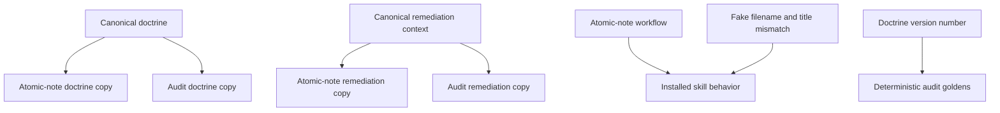
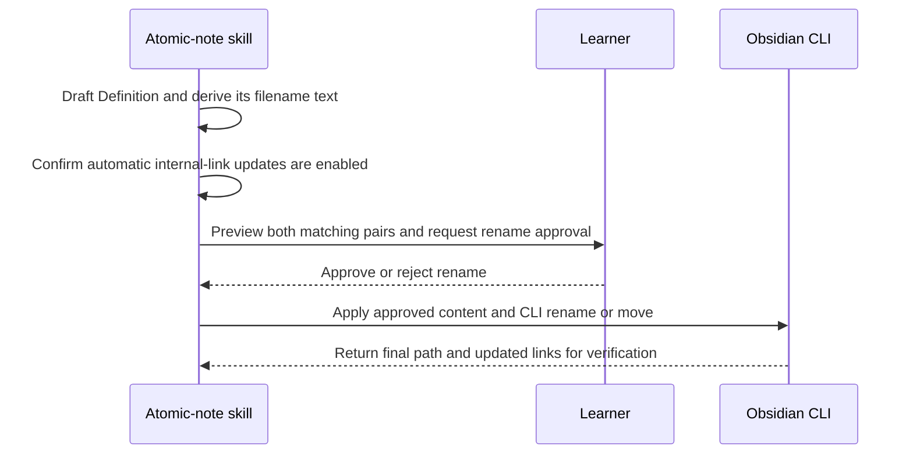

# Atomic Note Filename and Definition Alignment - Plan

## Goal Capsule

- **Objective:** Make every atomic-note filename match the Definition's first sentence after removing the timestamp and final period, while keeping the YAML title and H1 matched to the same short concept name.
- **Product authority:** GitHub issue #28, the Networked Thinking manuscript's filename rule, the manuscript's short-title guidance, companion-vault examples, and the Product Contract below.
- **Execution profile:** One canonical companion-vault template correction, doctrine and skill instructions, one fake example note that reproduces the bug, generated skill copies, and focused tests.
- **Stop conditions:** Stop if implementation requires bulk vault remediation or the broader deterministic audit work in issue #20.
- **Tail ownership:** The implementer owns generated-artifact synchronization, affected golden refreshes, running the fake regression example, both repositories' verification checks, and opening two cross-linked pull requests.

---

## Product Contract

### Summary

Every atomic note follows two simple naming rules.
The filename after its timestamp copies the Definition's first sentence without the final period, while the YAML `title` and H1 use the same short concept name.
When an improvement changes the Definition's first sentence, the workflow must rename the file through the official Obsidian CLI so Obsidian can update links to that note.
The canonical companion-vault template must teach these same two rules instead of saying the title and filename are both the full Definition sentence.

### Problem Frame

The manuscript already tells readers to copy the Definition's first sentence after the timestamp, without its final period.
The manuscript's atomic-note prompt and the companion-vault notes separately use a short concept name for both the YAML `title` and H1.
The current skill doctrine does not state these relationships clearly, and the improve-in-place workflow defaults to preserving the path unless a rename is explicitly approved.
An improved Definition can therefore leave behind a stale filename or let the short YAML title and H1 drift apart.

### Requirements

**Naming rules**

- R1. For every atomic note, the filename stem after the vault timestamp must exactly match the reader-visible first Definition sentence with its final period removed.
- R2. Markdown wrappers in the Definition, the timestamp, the `.md` extension, and the final period are not part of the filename text; all other visible words, capitalization, punctuation, and word order must match.
- R3. The YAML `title` and H1 must exactly match each other as the note's short concept name; they do not need to repeat the full Definition sentence.
- R4. Creation and improvement workflows must check both matching pairs before preview and write.

**Safe filename changes**

- R5. If an improvement changes the Definition's first sentence, the workflow must propose the corresponding filename change and obtain the approval required by the existing remediation contract.
- R6. An approved filename change must use the official Obsidian CLI `rename` or `move` command, never a direct filesystem rename.
- R7. Before renaming, the workflow must confirm that Obsidian's **Automatically update internal links** setting is enabled; after renaming, it must verify the new path and a representative set of affected links or backlinks.

**Regression and version maintenance**

- R8. A reusable fake example must start with a filename that does not match the Definition's first sentence and a YAML title that does not match the H1, then show both corrected pairs and the required Obsidian CLI rename and link-check steps.
- R9. Automated tests must validate the fake example and the skill/doctrine instructions that prevent the previous bad outcome.
- R10. The `doctrine_version` written into audit results must advance from `1.0.1` to `1.0.2`; schema, rubric, prompt, and package versions remain unchanged, and the Unreleased changelog must record the behavior change.
- R11. Generated skill-local references and scripts must be synchronized from canonical `shared/` sources.
- R12. If the rename is rejected, the workflow must not apply the Definition edit that would make the filename stale; it may keep the original first sentence or redraft the Definition without changing that sentence.
- R13. In the canonical `networked-thinking` companion-vault repository, the atomic-note template must say that YAML `title` and H1 use the short concept name, the filename after the timestamp uses the first Definition sentence without its final period, and the short name or acronym belongs in `aliases` when useful.
- R14. Deliver the work as two focused pull requests: one in `jrgilbertson/networked-thinking` for the canonical template correction and one in `jrgilbertson/networked-thinking-skills` for issue #28. Each PR must link the other and describe its repository-specific verification; opening the PRs does not authorize merging them.

### Acceptance Examples

- AE1. **Covers R1-R4.** Given a timestamped atomic note whose filename differs from the Definition's first sentence and whose YAML title differs from its H1, when the skill improves the note, then the filename matches the first sentence without its final period and the YAML title matches the H1 short concept name.
- AE2. **Covers R5-R8, R12.** Given an improved Definition changes its first sentence, when the skill applies the improvement, then it confirms automatic link updates are enabled, requests rename approval, and performs the approved rename through the Obsidian CLI; if approval is denied, it leaves no naming pair partially updated.
- AE3. **Covers R3.** Given an atomic note whose filename contains the full Definition sentence and whose YAML title and H1 use the same short concept name, when the skill checks alignment, then it accepts both pairs without expanding the short title into the Definition sentence.
- AE4. **Covers R13.** Given a learner opens the canonical companion-vault atomic-note template, then its placeholders describe the same two matching pairs as the manuscript and skill doctrine, with no instruction to copy the full Definition into YAML `title` or H1.
- AE5. **Covers R14.** Given both repository changes pass their checks, then two focused, cross-linked PRs are open against their respective repositories and neither has been merged.

### Success Criteria

- The fake mismatch example fails against the prior skill instructions and passes after the doctrine and workflow update.
- An improvement keeps the filename matched to the Definition's first sentence, keeps YAML title matched to H1, and never bypasses rename approval or the Obsidian CLI.
- Audit results report doctrine version `1.0.2`, while every unrelated version number remains unchanged.
- The canonical companion-vault template, manuscript guidance, and skill doctrine describe the same two naming pairs.
- Two cross-linked PRs are open, one per repository, with passing repository-specific checks.
- Generated skill artifacts and repository pre-commit checks pass.

### Scope Boundaries

- Bulk detection or remediation of mismatched notes in existing vaults is out of scope.
- Deterministic audit parsing, a new `title_body_mismatch` detector, and the broader audit work in GitHub issue #20 are out of scope.
- Replacing short YAML titles and H1s with the full Definition sentence is out of scope and would contradict the companion-vault convention.
- A general-purpose skill-testing framework is deferred; this change adds only the focused reusable fake example and its test.
- Private vault notes, names, highlights, and attachments must not appear in the fake example or its test output.

### Sources and Research

- GitHub issue #28: `https://github.com/jrgilbertson/networked-thinking-skills/issues/28`
- Related broader regression issue #20: `https://github.com/jrgilbertson/networked-thinking-skills/issues/20`
- Networked Thinking manuscript naming example: `https://github.com/jrgilbertson/networked-thinking-book/blob/main/manuscript/chapters/05-designing-your-workspace.md`
- Networked Thinking manuscript short-title guidance: `https://github.com/jrgilbertson/networked-thinking-book/blob/main/manuscript/appendices/appendix-d-ai-prompts.md`
- Canonical companion-vault atomic-note template: `https://github.com/jrgilbertson/networked-thinking/blob/main/Templates/Atomic%20Note%20Template.md`
- Companion-vault atomic notes as rendered through the book repository: `https://github.com/jrgilbertson/networked-thinking-book/tree/main/companion-vault/Atomic%20Notes`
- Official Obsidian CLI `rename` and `move` behavior: `https://obsidian.md/help/cli`
- Official automatic internal-link update setting: `https://obsidian.md/help/settings#Automatically-update-internal-links`
- Canonical doctrine: `shared/references/doctrine.md`
- Improvement and rename rules: `shared/references/remediation-context.md`
- Authoring workflow: `skills/atomic-note/SKILL.md`
- Doctrine-version precedent: `docs/solutions/conventions/plain-prose-dae-contract-migration.md`

---

## Planning Contract

### Key Technical Decisions

- KTD1. **Use the book and companion vault as the naming authority.** The filename copies the Definition's first sentence without its final period; YAML `title` and H1 share a short concept name. This applies to atomic notes by default rather than defining a special title category. *(Session-settled: user-directed; this is the book's default atomic-note rule.)*
- KTD2. **Require exact visible filename wording.** Remove only the timestamp, `.md` extension, Markdown wrappers, and final period before comparing the filename with the first Definition sentence. Semantic similarity is not enough because it can leave stale filenames.
- KTD3. **Treat the two pairs separately.** Filename and Definition sentence are one exact-match pair; YAML title and H1 are the other. Requiring identical text across all four fields would contradict the companion-vault convention.
- KTD4. **Rename only through Obsidian.** Use the official CLI `rename` or `move` command after confirming automatic internal-link updates are enabled, then verify the final path and affected links. A direct filesystem rename is forbidden because it bypasses Obsidian's link maintenance. *(Session-settled: user-directed; connected notes must keep working after a rename.)*
- KTD5. **Use one focused fake regression example.** Create a made-up note that contains both mismatches, state the requested improvement and correct result, and test that the production instructions require that result. This reproduces the bug without using private vault content or building a general testing framework.
- KTD6. **Update only the doctrine version number.** Audit results record which rulebook produced them in a `doctrine_version` field. Because this rulebook changes, advance that number from `1.0.1` to `1.0.2`; leave every unrelated version number unchanged.
- KTD7. **Correct the canonical companion-vault source, not the book's symlink.** Edit `Templates/Atomic Note Template.md` in the `jrgilbertson/networked-thinking` repository. The `networked-thinking-book/companion-vault` path is a symlink to that repository and must not receive a duplicate edit. *(Session-settled: user-directed; the adjacent inconsistency is included in this work.)*
- KTD8. **Ship one PR per repository.** Keep the companion-template change and the skill-contract change on separate branches with separate commits, open both PRs after verification, and cross-link them for reviewer context. Do not merge either PR without a separate request. *(Session-settled: user-directed.)*

### High-Level Technical Design

The artifact flow keeps shared sources authoritative and makes the regression case exercise the installed skill contract.

The improvement protocol keeps filename changes inside Obsidian so its link updater can run.

### Implementation Constraints

- Edit generated references and scripts under `shared/` first, then run the repository sync mechanism.
- Treat the companion-template correction as a separate, coherent change in the `networked-thinking` repository; do not edit the symlinked path in `networked-thinking-book`.
- Start the `networked-thinking` branch from the current remote default branch rather than its stale local `main`, which was two commits behind during planning.
- Keep repository histories independent: do not copy commits between repositories or combine their files in one worktree.
- Keep the fake example wholly invented and reusable across agent harnesses.
- Treat the manuscript and companion-vault template as the source of truth for the two naming pairs.
- Do not weaken existing preview, approval, app-context mutation, or post-write verification requirements.

### Sequencing

Correct the canonical companion-vault template first so the user-facing source and implementation contract start from the same two rules.
Define the doctrine and workflow rules next so the regression example checks the production instructions rather than a copied implementation.
Add the fake regression case third, then synchronize generated files and refresh version-bearing goldens after the version is final.
After both repositories pass their checks, commit each repository independently, push both branches, open the two PRs, and cross-link them.

---

## Implementation Units

### U1. Correct the Canonical Companion-Vault Template

- **Goal:** Remove the contradictory instruction that the title and filename both contain the full Definition sentence.
- **Requirements:** R1-R3, R13; KTD1, KTD3, KTD7.
- **Dependencies:** None.
- **Repository and file:** `jrgilbertson/networked-thinking`, `Templates/Atomic Note Template.md`.
- **Approach:** Preserve the existing frontmatter and H1 placeholders, but rewrite the explanatory placeholder to say that `{{Title}}` is the short concept name used by YAML `title` and H1, while the timestamped filename copies the first Definition sentence without its final period. Keep the existing aliases guidance for the short name and acronym where useful.
- **Execution note:** Update the canonical repository directly; the book repository will see the result through its `companion-vault` symlink.
- **Test scenarios:**
  - YAML `title` and H1 still use the identical `{{Title}}` placeholder.
  - The explanatory text calls `{{Title}}` a short concept name rather than a full Definition sentence.
  - The filename instruction calls for the first Definition sentence without its final period after the timestamp.
  - No malformed frontmatter, wikilink, placeholder, or unrelated template change is introduced.
- **Verification:** Targeted `rg`, Markdown review, and `git diff --check` pass in the `networked-thinking` repository; viewing the file through the book repository's symlink shows the same corrected text.

### U2. Define the Two Naming Rules and CLI Rename Behavior

- **Goal:** Make the canonical doctrine and atomic-note workflow enforce filename-to-Definition alignment, YAML-title-to-H1 alignment, and an Obsidian CLI rename when the Definition's first sentence changes.
- **Requirements:** R1-R7, R10, R12; KTD1-KTD4, KTD6.
- **Dependencies:** U1.
- **Files:** `shared/references/doctrine.md`, `shared/references/remediation-context.md`, `skills/atomic-note/SKILL.md`, `pyproject.toml`, `shared/scripts/audit_engine.py`, `tests/test_audit_engine.py`, `CHANGELOG.md`.
- **Approach:** Add the two matching rules to doctrine, add improvement-specific reconciliation and CLI rename approval to remediation context, and make the skill workflow check both pairs before preview/write and after mutation. Require the automatic-link-update setting before the rename. Advance only the doctrine version and its audit-row assertion, then record the fix under the Unreleased changelog.
- **Execution note:** Start with failing assertions for the absent naming rules and stale doctrine version, then update the production references and workflow.
- **Patterns to follow:** The version split and shared-source sequencing documented in `docs/solutions/conventions/plain-prose-dae-contract-migration.md`; the existing mutation and explicit rename-approval rules in `shared/references/remediation-context.md`; the official Obsidian CLI and automatic-link-update documentation listed in Sources and Research.
- **Test scenarios:**
  - A timestamp-stripped filename exactly matches the rendered first Definition sentence without its final period.
  - A difference caused only by a Markdown wrapper or final period remains aligned, while changed visible words, capitalization, punctuation, or word order do not.
  - YAML `title` and H1 use the same short concept name without being forced to repeat the Definition sentence.
  - An improved first Definition sentence requires previewing the corresponding filename and requesting rename approval before mutation.
  - With automatic internal-link updates enabled, an approved rename uses the official Obsidian CLI and verifies the new path plus affected links; a direct filesystem rename fails.
  - With automatic internal-link updates disabled, the workflow stops before renaming and tells the user what setting must be enabled.
  - A rejected rename does not write a Definition edit that would leave the filename stale.
  - Audit output reports doctrine version `1.0.2` while schema, rubric, prompt, and package versions stay at their prior values, and the Unreleased changelog names the filename/Definition alignment fix.
- **Verification:** The canonical references, workflow, version number, and focused assertion agree on the two naming rules and the CLI-only rename path.

### U3. Add a Fake Regression Example

- **Goal:** Preserve the reported bug as a reusable, privacy-safe example that prevents it from returning.
- **Requirements:** R3-R9; KTD2-KTD4.
- **Dependencies:** U2.
- **Files:** `tests/fixtures/atomic-note-skill/filename-definition-alignment.json`, `tests/test_atomic_note_skill_examples.py`, `skills/atomic-note/SKILL.md`, `shared/references/doctrine.md`, `shared/references/remediation-context.md`.
- **Approach:** Encode one invented existing note, an improvement request that changes the Definition's first sentence, the expected two matching pairs, and the expected CLI rename and verification steps. The focused test validates that the example is complete and that the production skill instructions require the expected behavior, without reimplementing the skill in test code.
- **Execution note:** Show that the focused test fails when the new production instructions are absent, then passes after U2.
- **Patterns to follow:** Fixture privacy rules in `docs/contributor-guide.md` and production-artifact assertions in `tests/test_skill_integrity.py`.
- **Test scenarios:**
  - The starting filename differs from the first Definition sentence, and the starting YAML title differs from the H1.
  - The expected outcome matches the timestamp-stripped filename to the first Definition sentence without its final period, and independently matches the YAML title to the short H1.
  - The expected steps require preview, explicit rename approval, confirmation that automatic link updates are enabled, an Obsidian CLI `rename` or `move`, and post-write path and link verification; a direct filesystem rename fails the test.
  - A denied rename leaves the original first Definition sentence and filename unchanged, or redrafts without changing that first sentence; a Definition-only update fails the test.
  - The fixture and test contain no real vault paths, names, note content, attachments, or private source material.
  - Removing the new alignment clause from the production doctrine or workflow makes the contract test fail.
- **Verification:** The focused unittest fails without the new production instructions and passes with them; the fixture plainly shows the bad starting note and correct expected result.

### U4. Synchronize Generated Contracts and Version-Bearing Goldens

- **Goal:** Publish the canonical doctrine, remediation, and version changes into both installable skills while keeping deterministic outputs reproducible.
- **Requirements:** R10, R11.
- **Dependencies:** U2, U3.
- **Files:** `skills/atomic-note/references/doctrine.md`, `skills/atomic-note/references/remediation-context.md`, `skills/atomic-note-audit/references/doctrine.md`, `skills/atomic-note-audit/references/remediation-context.md`, `skills/atomic-note-audit/scripts/audit_engine.py`, `tests/golden/fixture-audit.jsonl`, `tests/test_skill_artifact_sync.py`.
- **Approach:** Run the canonical artifact sync after shared edits settle, regenerate only deterministic audit rows that record the doctrine version, and confirm no schema/rubric/prompt/package version moved accidentally.
- **Patterns to follow:** `shared/scripts/sync_skill_artifacts.py`, `tests/test_skill_artifact_sync.py`, and the golden-refresh sequencing in `docs/solutions/conventions/plain-prose-dae-contract-migration.md`.
- **Test scenarios:**
  - Both installable skills contain generated doctrine and remediation text identical to their canonical shared sources.
  - The generated audit engine reports the same doctrine version as `shared/scripts/audit_engine.py`.
  - Every fixture audit row carries doctrine version `1.0.2`; all other row content remains unchanged.
  - Schema, rubric, prompt, and package versions remain unchanged.
- **Verification:** Artifact sync check, JSONL validation, affected golden tests, and the repository pre-commit check all pass with no stale generated file.

### U5. Commit, Push, and Open Both Pull Requests

- **Goal:** Deliver the verified changes for review in their correct repositories without merging them.
- **Requirements:** R14; KTD8.
- **Dependencies:** U1-U4.
- **Repositories:** `jrgilbertson/networked-thinking`, `jrgilbertson/networked-thinking-skills`.
- **Approach:** Review each repository's final diff and status, create one coherent value-focused commit per repository, push each feature branch, and open one PR against each repository's default branch. Link issue #28 from the skills PR and cross-link the two PRs in their descriptions or follow-up comments.
- **Test scenarios:**
  - The `networked-thinking` PR contains only the canonical template clarification.
  - The `networked-thinking-skills` PR contains only issue #28's doctrine, workflow, fixture, test, generated-artifact, golden, changelog, and plan changes.
  - Each PR records the checks run in its own repository and links its companion PR.
  - Neither PR is merged as part of this unit.
- **Verification:** Both PR URLs resolve, their diffs match the intended repository scopes, their base branches are correct, and the two PRs reference each other.

---

## Verification Contract

| Gate | Command or evaluation | Done signal |
|---|---|---|
| Companion template | In `networked-thinking`: targeted `rg` plus `git diff --check` | The template states the two naming pairs, preserves valid Obsidian Markdown/frontmatter, and contains no unrelated edits. |
| Naming-rule tests | `env PYTHONDONTWRITEBYTECODE=1 python3 -m unittest tests.test_atomic_note_skill_examples tests.test_audit_engine` | The fake example, production-instruction assertions, and doctrine-version assertions pass. |
| Generated artifacts | `python3 -m shared.scripts.sync_skill_artifacts --check` | No generated reference or script is stale. |
| Golden validity | `python3 -m shared.scripts.validate_jsonl tests/golden/fixture-audit.jsonl` | All regenerated audit rows validate with the new doctrine version. |
| Skill example review | Compare `tests/fixtures/atomic-note-skill/filename-definition-alignment.json` with the installed `atomic-note` instructions | The input reproduces both mismatches, and the expected result requires both matching pairs plus the approved Obsidian CLI rename and link checks. |
| Repository gate | `lefthook run pre-commit --force --no-auto-install` | The full repository check passes, including unit tests, JSONL validation, install verification, and artifact sync. |
| Pull-request delivery | Inspect both GitHub PRs after push | One correctly scoped PR is open in each repository, both target the intended default branch, and they cross-link each other without being merged. |

---

## Definition of Done

- U1 is complete when the canonical companion-vault template teaches the two naming pairs and the book's symlink exposes the corrected text.
- U2 is complete when doctrine, remediation, authoring workflow, and the doctrine version express the two naming rules while preserving approval boundaries and requiring Obsidian CLI renames.
- U3 is complete when the fake mismatch example and its focused test fail without the production instructions and pass with them, including the CLI-only rename requirement.
- U4 is complete when all generated skill artifacts and version-bearing goldens are synchronized and deterministic.
- U5 is complete when both repository-specific commits are pushed and two correctly scoped, cross-linked PRs are open but unmerged.
- Every applicable acceptance example is represented by a named test or explicit fixture assertion.
- The focused verification gates and full pre-commit check pass.
- The final diff contains only issue #28 work; general testing-framework scaffolding, deterministic semantic detection, and unrelated cleanup are absent.
